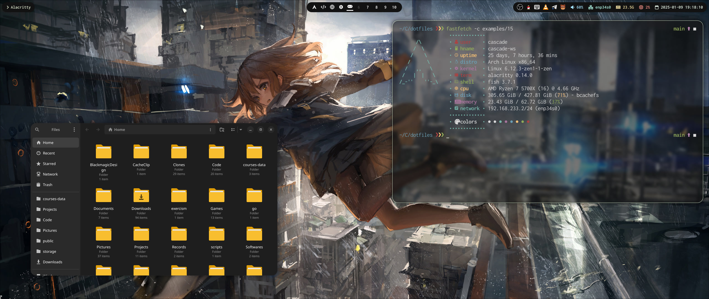

## Dotfiles
This repository stores my desktop configuration. The main branch will keep updated with the configuration on my computer.

The dotfiles have some specific configurations for NVIDIA, if you are using other graphics adapters, you may need to remove these configs.

### PC Build
| Component | Name |
| --------: | - |
| CPU | AMD Ryzen 7 3700X |
| Graphics | NVIDIA GeForce RTX 2060 SUPER |
| Monitor | 2560x1080 @ 200Hz   2560x1440 @ 165Hz   1920x1200 @ 144Hz |
